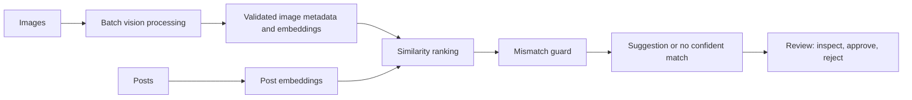

# Usage Metering and Billing Engine

This capstone combines a reliable SaaS usage-metering and billing backend with an AI-assisted semantic image recommendation workflow. The service uses FastAPI, PostgreSQL, Docker Compose, and Stripe Test Mode. The AI capability uses a free-tier Gemini Flash model or local Ollama models, validates all structured vision responses, and routes uncertain recommendations to review instead of accepting them silently.

## Architecture



See [the full architecture](docs/specs/architecture.md), [the requirement contract](docs/specs/ai-image-recommendation-requirements.md), and [the capstone constraints](docs/specs/capstone-constraints.md).

## Image dataset

The repository includes a 50-image development corpus under `data/corpus/raw/`. It contains 10 JPG images in each of five categories: red fox, wolf, dog, bear, and deer. The batch-processing and retrieval features will use this small corpus to validate metadata extraction, embeddings, semantic matching, and mismatch rejection while staying within free-tier limits.

Before model processing begins, `data/corpus/manifest.csv` must record each image's ID, file path, manual label, original source URL, and license URL. The committed manifest records the provenance needed to reproduce the dataset and begin processing.

## Evaluator quick start

Use this section when running the project for the first time on a new computer. The initial setup creates the PostgreSQL tables and registers the 50-image corpus. After setup, a single Docker Compose command starts the API, database, and image worker together.

### Prerequisites

- Docker Desktop running with Linux containers enabled.
- Python 3.12 or later.
- A Gemini API key in `.env`. Do not commit this file.

### First-time setup

Run these commands from the repository root in PowerShell:

```powershell
# Create and activate the local Python environment.
python -m venv .venv
.\.venv\Scripts\Activate.ps1
python -m pip install -e ".[dev]"

# Create the local configuration file, then add GEMINI_API_KEY to it.
Copy-Item .env.example .env

# Start PostgreSQL, create the tables, and register the committed image corpus.
docker compose up -d postgres
alembic upgrade head
python -m app.cli.import_corpus

# Start the API and the paced image worker in the background.
docker compose up -d --build api image-worker
```

The worker processes one image at a time. It validates Gemini metadata, stores accepted metadata, and automatically creates an embedding for each accepted image. It is safe to leave the worker running while testing the API.

### Normal startup after first-time setup

After the database volume already exists, use one command to start the complete project:

```powershell
docker compose up --build
```

This starts PostgreSQL, FastAPI, and the image worker together. Keep this terminal open to see logs. Use `docker compose up -d --build` to run the same services in the background.

### Verify the running services

```powershell
# Confirm the API is running.
Invoke-RestMethod http://localhost:8000/health

# See image-processing progress.
docker compose exec postgres psql -U metering -d metering -c "SELECT processing_status, count(*) FROM images GROUP BY processing_status;"

# Inspect model-call usage and recorded free-tier costs.
python -m app.cli.vision_costs
python -m app.cli.embedding_costs
```

### Test image matching in Postman

1. Send `POST http://localhost:8000/posts` with this raw JSON body:

```json
{
  "text": "A red fox in a snowy forest"
}
```

2. Copy the returned `id`.
3. Send `GET http://localhost:8000/posts/<id>/images`. A GET request has no body.

The endpoint returns up to three passing image suggestions, guard rejections with explanations, or `no_confident_match` when no accepted image embedding meets the rules. Create a new post for each new matching attempt because the system saves the result for that post.

Run the automated checks without calling Gemini:

```powershell
pytest
ruff check app tests
mypy app
```
## Step 2: Image understanding pipeline

The background worker validates Gemini vision output, stores image metadata, tracks each model call, and waits 30 seconds between image attempts by default. It processes one image at a time without blocking the FastAPI API.

### 1. Configure `.env`

Copy `.env.example` to `.env`, then set these values:

```env
GEMINI_API_KEY=your_gemini_api_key
GEMINI_VISION_MODEL=gemini-3.6-flash
IMAGE_WORKER_PROCESSING_DELAY_SECONDS=30
```

Increase the delay to `60` seconds for a slower free-tier pace. Do not commit `.env`.

### 2. Import and process the full corpus

Run these commands from the repository root:

```powershell
# Start PostgreSQL and create the database tables.
docker compose up -d postgres
alembic upgrade head

# Register all manifest images. Re-running this safely skips existing images.
python -m app.cli.import_corpus

# Start the worker in the background.
docker compose up -d --build --force-recreate image-worker
```

### 3. Monitor the background worker

View recent worker activity:

```powershell
docker compose logs --tail 50 image-worker
```

Count images by processing status:

```powershell
docker compose exec postgres psql -U metering -d metering -c "SELECT processing_status, count(*) FROM images GROUP BY processing_status;"
```

View recorded Gemini calls, input and output units, and estimated cost:

```powershell
python -m app.cli.vision_costs
```

Stop processing at any time:

```powershell
docker compose stop image-worker
```

Step 2 is complete when every corpus image is `accepted` or `needs_review`, no image is `pending`, `processing`, `retry_scheduled`, or `failed`, and `vision_costs` shows the recorded calls.

## Step 3: Matching engine

Step 3 creates 768-dimension Gemini text embeddings for accepted image metadata and post text. The matching service uses pgvector cosine similarity, returns at most three passing candidates, and records every rejected candidate with an explanation. A post can still receive suggestions while the corpus is processing, using only accepted images that already have embeddings.

### 1. Configure embeddings

Add these values to `.env`. The zero cost rate records free-tier usage without estimating a charge.

```env
EMBEDDING_MODEL=gemini-embedding-001
GEMINI_EMBEDDING_INPUT_COST_PER_MILLION_UNITS=0
```

### 2. Backfill accepted image embeddings

The image worker automatically creates an embedding after a vision result is accepted. Use this command to safely embed accepted images processed before Stage 3. It skips unchanged image text, so it can be run again after more images become accepted.

```powershell
python -m app.cli.embed_corpus
```

Inspect recorded embedding calls and estimated costs:

```powershell
python -m app.cli.embedding_costs
```

### 3. Create a post and retrieve suggestions

Start the API, then create a post:

```powershell
uvicorn app.main:app --reload

Invoke-RestMethod -Method Post -Uri http://localhost:8000/posts -ContentType 'application/json' -Body '{"text":"A red fox in a snowy forest"}'
```

Copy the returned post ID, then retrieve suggestions:

```powershell
Invoke-RestMethod http://localhost:8000/posts/<post-id>/images
```

The response returns ranked passing suggestions first. It also records and exposes guard rejections, such as a wolf image rejected for a red-fox post. If no candidate passes, the response returns `no_confident_match` with a reason.

## Evaluation

Top-1 precision has not been measured because the labeled post-to-image evaluation set has not been created. The matching implementation is available. When evaluation begins, this section will report the measured precision, the number of labeled posts, and the command used to reproduce it.

## Project rules

The project remains in one public repository, uses only free-tier tools, records material AI assistance in `BUILDLOG.md`, and keeps API keys only in `.env`. Review completion evidence in `EVIDENCE.md`.
