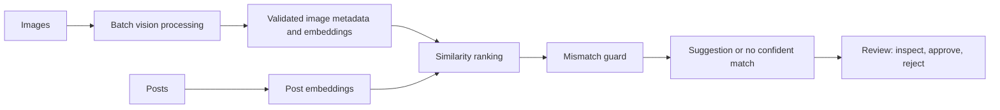

# Usage Metering and Billing Engine

This capstone combines a reliable SaaS usage-metering and billing backend with an AI-assisted semantic image recommendation workflow. The service uses FastAPI, PostgreSQL, Docker Compose, and Stripe Test Mode. The AI capability uses a free-tier Gemini Flash model or local Ollama models, validates all structured vision responses, and routes uncertain recommendations to review instead of accepting them silently.

## Architecture

See [the full architecture](docs/specs/architecture.md), [the requirement contract](docs/specs/ai-image-recommendation-requirements.md), and [the capstone constraints](docs/specs/capstone-constraints.md).

## Image dataset

The repository includes a 50-image development corpus under `data/corpus/raw/`. It contains 10 JPG images in each of five categories: red fox, wolf, dog, bear, and deer. The batch-processing and retrieval features will use this small corpus to validate metadata extraction, embeddings, semantic matching, and mismatch rejection while staying within free-tier limits.

Before model processing begins, `data/corpus/manifest.csv` must record each image's file path, manual label, original source URL, and license URL. This provenance manifest is still pending and must be completed before the dataset is considered reproducible and ready for processing.

## Evaluation

Top-1 precision has not been measured because the labeled post-to-image evaluation set and retrieval implementation have not been created. When evaluation begins, this section will report the measured precision, the number of labeled posts, and the command used to reproduce it.

## Project rules

The project remains in one public repository, uses only free-tier tools, records material AI assistance in `BUILDLOG.md`, and keeps API keys only in `.env`. Review completion evidence in `EVIDENCE.md`.
