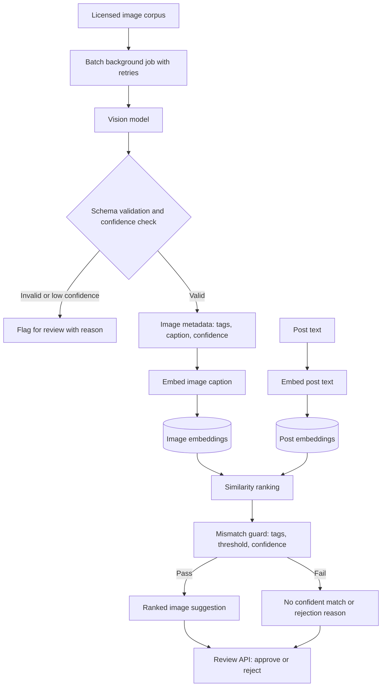

# Architecture overview

The API receives authenticated usage events, Stripe webhooks, images, posts, and review decisions. PostgreSQL is the source of truth for billing-related state and image-recommendation records. Domain services calculate billing amounts using `Decimal`; request handlers orchestrate validation and responses only.

Usage writes must be atomic and reject a duplicate idempotency key for the same customer and source. Stripe webhook processing must verify the signature from the raw body, persist the Stripe event ID transactionally, and safely acknowledge repeated deliveries without repeating side effects.

## AI image recommendation flow

The two embedding streams meet only at similarity ranking. Every recommendation passes the mismatch guard before a human sees it. The guard considers semantic similarity, image tags, vision confidence, and configured thresholds. It rejects an obviously incorrect recommendation, such as a wolf image suggested for a red-fox post, and records a human-readable explanation.
